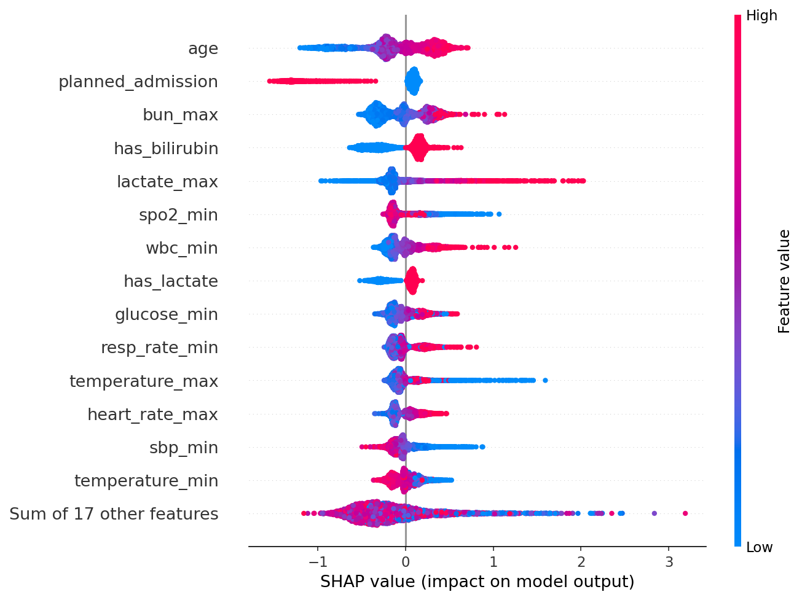
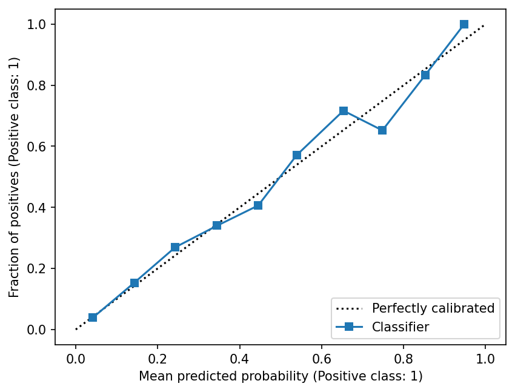

# sepsis-mortality-prediction
Predicting in-hospital mortality for ICU patients with sepsis using MIMIC-IV, SQL (BigQuery), and Python (XGBoost, SHAP)

## Overview
This project predicts in-hospital mortality for adult ICU patients with sepsis, using clinical data from their first 24 hours in the ICU. The goal is to help clinicians identify the highest-risk patients early, so they can prioritize monitoring and treatment. The best model, XGBoost, reached an AUROC of 0.84 on held-out test patients, compared with 0.62 for the SOFA score alone.

## Data
- **Source:** [MIMIC-IV v3.1](https://physionet.org/content/mimiciv/) from PhysioNet, a de-identified database of ICU patients from Beth Israel Deaconess Medical Center (Boston). Accessed through Google BigQuery under a credentialed data use agreement.
- **Cohort (20,963 patients):** adults(18+), first ICU stay only, who met the Sepsis-3 criteria within their first 24 hours in the ICU.
- **Outcome:** in-hospital death (15.0% of patients).
- **Features:** vital signs, lab tests (bloodwork), and lactate from the first 24 hours, plus age, sex, SOFA score, and admission type.

- ## Method

**1. Cohort and features (SQL, BigQuery)**
- `cohort_base`: adult patients, first ICU stay only(65,366 stays)
- `cohort_sepsis`: added the Sepsis-3 flag from the MIMIC derived tables
- `cohort_final`: kept only patients septic within the 24 hours of ICU admission (20,963)
- `cohort_features`: added first-day vital signs, lab tests, and lactate, plus "was measured" flags for bilirubin and lactate

**2. Cleaning (Python)**
- converted temperature to a numeric type
- Removed physiologically impossible values (e.g. SpO2 = 1%, lactate = 89), set to missing

**3. Preparing the data**
- Target: in-hospital death. Features (31): first-day vital signs and labs, age, sex, admission type, SOFA score
- Excluded ICU length of stay (data leakage: only know after discharge or death
- Split: 80% training / 20% test, stratified on the outcome
- Encoded sex as 0/1, and admission type as a planned vs unplanned flag
- Filled missing values with training-set medians, and scaled features (for logistic regression)

**4. Models**
- Logistic regression (interpretable baseline)
- XGBoost (captures non-linear effects)
- Both compared with the SOFA score alone, the standard clinical severity measure

**5. Evaluation and Explanation**
- AUROC, AUPRC, precision and recall at different cutoffs, calibration
- SHAP to explain which features drive XGBoost's predictions

## Results

| Model | AUROC | AUPRC |
|---|---|---|
| SOFA score alone (clinical baseline) | 0.62 | – |
| Logistic regression | 0.81 | 0.49 |
| **XGBoost** | **0.84** | **0.55** |

*AUPRC random baseline = 0.15 (the mortality rate). Evaluated on 4,193 held-out test patients.*

**Key Findings**
- **XGBoost performed best** (AUROC 0.84), well above the SOFA score alone (0.62), and slightly above logistic regression (0.81). It likely captures threshold effects, such as SpO2, where risk rises sharply only below ~90%.
- **Top predictors (SHAP):** age, planned admission (protective), BUN, whether bilirubin was tested, and lactate. Patterns were clinically coherent: high lactate, low blood pressure, low SpO2, and the absence of fever all raised the predicted risk.
- **Well calibrated:** predicted risks closely matched observed death rates, especially in the 0-40% range where most patients fall, so the model's percentages can be read as real risks.

## Key Decisions

- **Preventing data leakage:** everything the model learned from (imputation medians, scaling) was calculated on the training set only; the test set was used only for final evaluation. I also excluded ICU length of stay, which is only known after discharge or death.
- **Clinically guided cleaning:** I removed only physiologically impossible values (e.g. SpO2 = 1%, lactate = 89 mmol/L, likely a unit error), and kept extreme but real ones (e.g. WBC = 471 in leukemia). In total, under 1% of values were removed, because in sepsis, the most abnormal patients are the most important to learn from.
- **Informative missingness:** bilirubin (41% missing) and lactate (27%) are often only tested when clinicians are worried. I filled missing values with training medians, and added "was measured" flags so this information wasn't lost. SHAP later confirmed that being tested for bilirubin was a strong predictor.
- **Choosing a risk threshold:** at a 50% cutoff, the model caught only 28% of deaths.

## Limitations and Next Steps

-**Single hospital:** MIMIC-IV comes from one hospital in Boston, so the model may not generalize to other hospitals. **Next step:** external validation or another dataset (e.g eICU, a multi-hospital database).
- **Fairness not yet assessed:** race and insurance were excluded as features, but performance across demographic groups wasn't checked. **Next step:** compare AUROC and calibration by sex, race, and insurance.
- **Patients who died within 24 hours** were kept, though their outcome is partly known at prediction time. **Next step:** exclude them and compare results
- **Moderate overfitting:** XGBoost scored 0.91 on training data vs 0.84 on test. **Next step:** tune its settings, and add chronic conditions (comorbidities) as features.

## Tools

- **SQL** (Google BigQuery): cohort building and feature extraction
- **Python** (Google Colab)
  - **pandas:** data cleaning and exploration
  - **scikit-learn:** train/test split, preprocessing, logistic regression, evaluation metrics
  - **XGBoost:** gradient boosting model
  - **SHAP:** model explainability
  - **matplotlib:** charts
- **GitHub:** version control and project sharing
